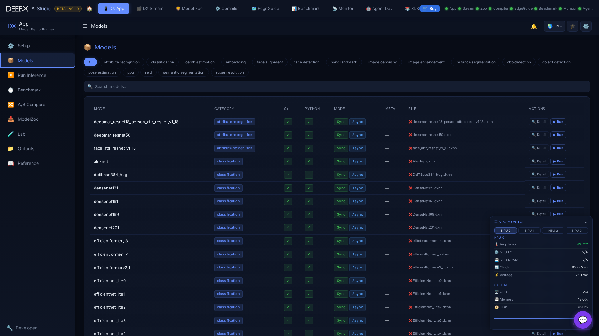

# DX App

Run AI inference on the DEEPX NPU from your browser — pick a model, run it on images,
video, a camera or an RTSP stream, watch live results, and benchmark or compare models.

## Using it

The dashboard opens on a set of pages (top navigation):

- **Setup** — guided environment check; run it first so the NPU / runtime is ready.
- **Models** — browse the model registry across 23 AI tasks (detection, classification,
  segmentation, pose, depth, super-resolution, 3D object detection, and more); open a
  model for details.
- **Run** — pick a **category → model → input**, then Run. Inputs adapt to the category:
  a sample image, your **own uploaded image**, video, camera, or RTSP (some tasks are
  image-only; special inputs like 3D LiDAR `.bin` appear where they apply). The annotated
  result shows live, with a **before/after compare slider** for image runs, and multiple
  streams can run at once.
- **Bench** / **Compare** — measure a model's throughput and compare models side by side.
- **Model Zoo** — browse and download additional models into the app.
- **Outputs** — browse and manage saved inference results.

Works **without an NPU** too — every page falls back to mock data so you can explore the UI.

!!! note "Related"
    Run the `.dxnn` files produced by **[DX Compiler](03_DX_Compiler.md)**; the same
    NPU telemetry is visualized live in **[DX Monitor](08_DX_Monitor.md)**.
