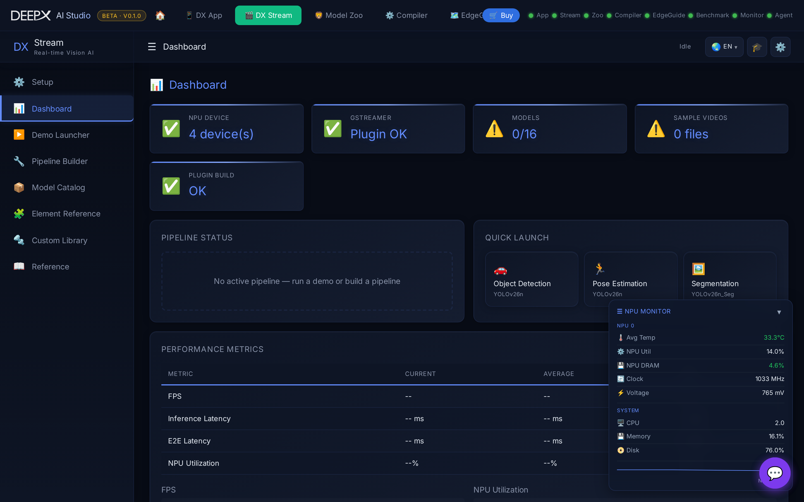

# DX Stream

Run real-time GStreamer vision-AI pipelines on the DEEPX NPU from your browser — start a
preset demo (object detection, face, pose, multi-stream, …), watch the live annotated
video, and inspect the pipeline.

## Using it

1. **Pick a demo** by category — e.g. **Object Detection**, **Face Detection**, **Pose**,
   **Multi-Stream** (several sources at once), Multi-Stream RTSP, and more.
2. **Start** the pipeline — the processed video plays live in the browser (WebRTC).
3. **Watch / stop** — the live view shows detections overlaid on the stream; stop or
   switch demos at any time. The pipeline diagram shows the GStreamer stages in use.

## Key features

- **Preset pipelines** across several vision-AI categories, including **multi-stream**
  (multiple video sources processed together) and RTSP inputs.
- **Live WebRTC playback** of the NPU-processed video in the browser.
- **Clear error surfacing** — if a stream fails or stalls, a persistent error is shown
  (no silent black screen), with retry.
- **Pipeline visualization** — see the GStreamer elements the demo runs.
- **AI assistant** chat for help.

!!! note "Related"
    DX Stream pipelines run the same `.dxnn` models compiled in
    **[DX Compiler](03_DX_Compiler.md)**.
