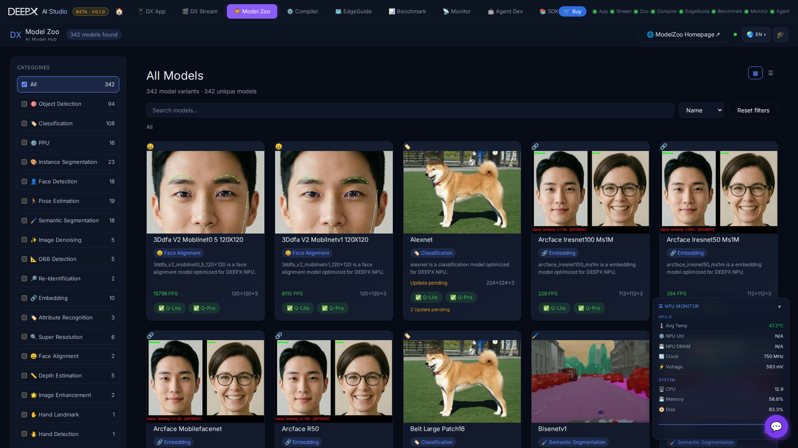

# DX Model Zoo

Browse the DEEPX model catalog (340+ models) — search and filter by AI task, open a
model to see its details (accuracy, input, license / source), and use it in the other
studio tools.

## Using it

1. **Browse or search** the catalog; filter by **category** (image classification,
   object detection, segmentation, pose, …), toggle **card / list** view, and sort. Cards
   show **Q-Lite / Q-Pro** variant badges.
2. **Open a model** to see its detail view: task, input shape, accuracy metrics, legal
   info (license / source / copyright), and example images with a before/after slider.
3. **Download** its artifacts — the Q-Lite or Q-Pro `.dxnn` (with progress / cancel), plus
   ONNX and JSON.
4. **Try it in-browser** — run inference right from the detail view (upload or sample
   image) against your local DX App: see the result image, predictions, FPS, and a
   per-stage latency table, and switch the execution path (C++/Python × Sync/Async).
5. Or pull the model into **[DX App](04_DX_App.md)** or **[DX Compiler](03_DX_Compiler.md)**
   (the detail view also links straight to "View Model Graph" and a compile guide).

## Key features

- **340+ models** across many vision-AI tasks, with per-category filtering, search, sort,
  and card/list views.
- **In-browser inference demo** and one-click artifact **downloads** from the detail view.
- **Rich detail view** — accuracy, license / source / copyright, copyable demo code
  (C++/Python/CLI), and save-as-HTML model card.
