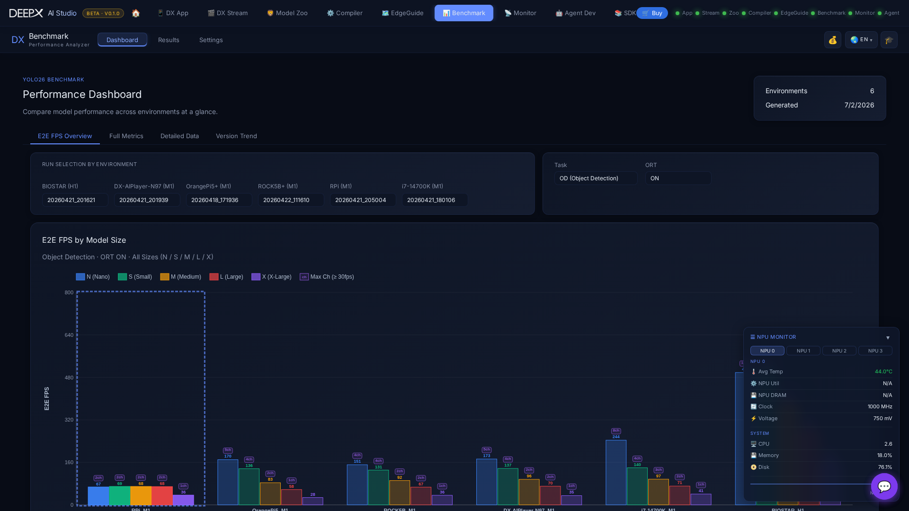

# DX Benchmark

Browse and compare DEEPX NPU benchmark results in your browser — throughput, latency,
and multi-stream numbers per model, with charts.

## Pages

- **Dashboard** — throughput (FPS), latency (ms), and multi-stream **channel** figures per
  model. Compare across **NPU environments / host PCs side by side**, filter by task and
  model size, toggle ONNX-runtime on/off, and click a chart bar or table row to drill in.
  Panels show environment details and the benchmarked-model specs.
- **Results** — browse past runs by hardware and run-ID; open each run's Markdown report
  and raw JSON.
- **Version Trend** — a metric line chart across historical runs, to see performance move
  between versions.
- **Settings** — the (read-only) deployment config: directories, thermal cooldown,
  iterations / warm-up / FPS threshold.

A one-click link hands the current selection to **[DX EdgeGuide](09_DX_EdgeGuide.md)**,
which uses the same data to recommend hardware.

*What "max-channel" means:* the highest number of simultaneous video streams a model
sustains on that NPU while meeting the FPS threshold.

!!! note
    The dashboard is **read-only**; the benchmark runs themselves are produced by the
    DEEPX benchmark tooling, and their results feed this view (and DX EdgeGuide).
