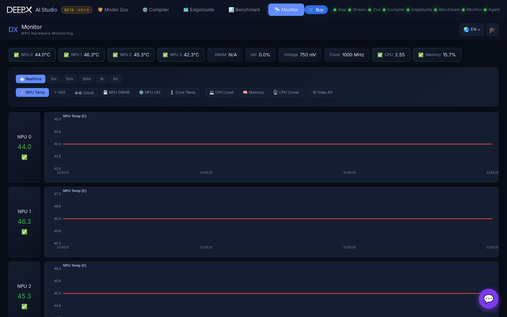

# DX Monitor

A real-time hardware dashboard for your DEEPX NPU and host — temperature, voltage,
clock, DRAM, and utilization, alongside CPU and memory, plus the installed SDK / driver
versions.

## Using it

1. Open the dashboard — it shows live **NPU** telemetry per device (temperature,
   voltage, clock, DRAM, utilization) and **system** stats (CPU load, memory).
2. Watch the live charts while you run inference or benchmarks in the other tools.
3. Check the **versions** panel for the installed runtime / driver / SDK versions.

## Key features

- **Live NPU telemetry** per device, with status coloring.
- **System stats** — CPU cores, load, memory.
- **Version info** — DX-RT / DX-APP / SDK / driver versions.
- Falls back to **mock telemetry** when no NPU is present (for exploring the UI).

!!! note
    The same version and device information is available on the command line via
    `dxcli --status`.
