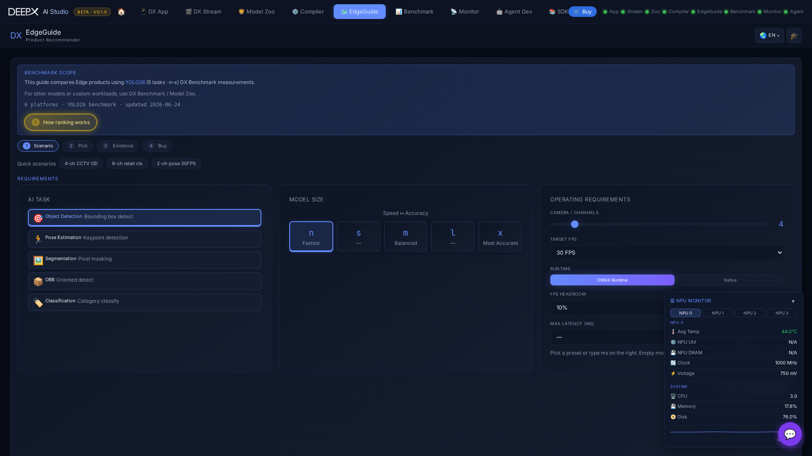

# DX EdgeGuide

Pick the best DEEPX Edge AI product (NPU board + host) for your computer-vision
workload. Describe the workload; EdgeGuide ranks the platforms that can handle it using
real **YOLO26 benchmark** measurements, then lets you drill into a platform, compare it
with another, review the evidence, and get product info / a price quote.

## Using it

The whole tool is one page with a four-step strip — **Scenario → Pick → Evidence → Buy** —
where panels open as you go.

### 1. Describe the workload (Requirements panel)

- Optionally click a **Quick scenario** chip (**CCTV / Retail / Pose**) to prefill.
- **AI task**: Object Detection / Pose Estimation / Segmentation / Oriented BBox /
  Classification.
- **Model size**: n (fastest) → x (most accurate).
- **Operating requirements**: cameras / **channels**, **target FPS**, runtime
  (ONNX Runtime vs Native), **FPS headroom**, **max latency**.
- Click **Next: priority**, choose a **ranking priority** — Lowest Cost / Best
  Performance / Lowest Power — then **Get Recommendations**. (After the first run,
  changing any input auto-refreshes the results.)

### 2. Read the recommendations

A verdict line shows the **Top pick** and whether your channel / FPS target is met;
ranked cards carry a confidence badge (Measured → Interpolated → Theoretical) and flags
like *Host-limited*. Click a card (or a bar in the throughput chart) to open details.

### 3. Explore / compare

The Details panel shows key facts, platform specs, a Performance Radar, a sortable
benchmark table, and a per-model-size chart; **task tabs** let you view the same platform's
numbers for other AI tasks. The charts and table are interactive — click a model-size bar
or a table row to re-run the recommendation at that size. Use **Compare with** to line up
a second platform side by side (with a summary count of Meets / Insufficient / Theoretical).

### 4. Buy / contact

The Buy panel shows the system price and approximate **cost per channel**, with **Product
info** and **Request quote** buttons to DEEPX.

## Key features

- **Real measurements** — recommendations come from the YOLO26 benchmark matrix, not
  spec-sheet math; every number is tagged by confidence (measured → theoretical).
- **Open methodology** — the **How ranking works** button shows the exact formulas and a
  live summary; it also states the honest limits (the figures are not a full spec sheet,
  and the shown cost is NPU-board price per channel — **not** full TCO; host / power /
  install are extra).
- **Multi-stream evidence** — per-channel and total FPS behind each channel estimate.
- **Shareable & resumable** — the current selection is captured in the URL (a link, e.g.
  arriving from [DX Benchmark](07_DX_Benchmark.md), reproduces the inputs and re-runs), and
  your last inputs are also restored locally on reload.
- **AI Help** chat for follow-up questions grounded in your requirements / results.
