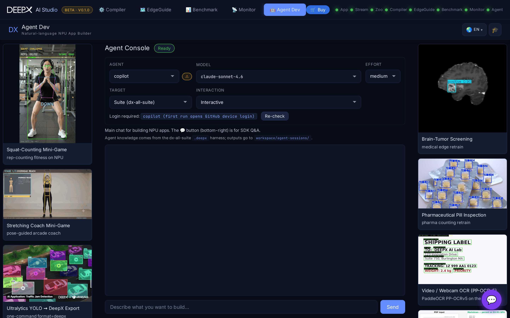

# DX Agent Dev

A natural-language console for building DEEPX NPU apps: describe what you want, and a
coding agent generates and runs it. It is also a chat assistant and a gallery of
ready-made showcases.

## Using it

1. **Connect an agent** — the console detects installed coding CLIs. Five are supported:
   **Claude Code** (`claude`), **GitHub Copilot CLI** (`copilot`), **Cursor**
   (`cursor-agent`), **Codex** (`codex`), and **OpenCode** (`opencode`). A badge shows
   whether each is signed in; if a login is needed it shows the exact command to run,
   then re-checks.
2. **Set the run** using the console controls:
      - **Agent picker** — which of the 5 CLIs to use.
      - **Model picker** — a dropdown of that agent's models; for CLIs that support
        listing them (Cursor, OpenCode) it's enumerated live from the CLI, otherwise it
        falls back to a built-in list. A hint warns if the chosen model is too weak and
        suggests a stronger one.
      - **Reasoning-effort picker** — the effort levels that agent's CLI supports.
      - **Target workdir** — which repo the agent works in: Suite, dx-runtime, dx_app,
        dx_stream, dx-compiler.
      - **Interaction mode** — Interactive (asks questions) or Autopilot (no questions).
3. **Describe your task** in the prompt — the agent works and streams its progress live;
   an expandable **activity panel** shows each turn's shell / tool output next to the reply.
4. **Chat** — the main console chat is for building NPU apps via the connected coding
   agent. The **💬 button** (bottom-right) is a separate affordance: a general SDK Q&A
   assistant, not part of the Agent Console run.
5. **Showcases** — browse the gallery of example NPU apps for reference.

### If no CLI is available, or the harness isn't found

- **No coding-agent CLI installed/authenticated** — install and log into one of the 5
  above, then reload the page. (The 💬 chat still works — it doesn't need a CLI.)
- **`.deepx` harness directory not found** — the agent knowledge/skills directory is
  missing. Set the `DX_HARNESS_ROOT` environment variable to your dx-all-suite checkout,
  or run DX AI Studio from within the suite, then reload the page.

## Key features

- **Bring-your-own agent** — uses whatever coding CLI you have installed and signed in;
  one login powers both the generator and the chat.
- **Local / self-hosted LLM** support (any OpenAI-compatible endpoint; auto-discovers
  models). No API key is stored — it is just an HTTP client.
- **SDK knowledge** — the assistant can pull in DEEPX SDK documentation to answer
  accurately, with a refresh button to update it.
- **Live streaming** of the agent's work, with a wall-clock timeout so a stuck run frees
  the slot for the next request.
