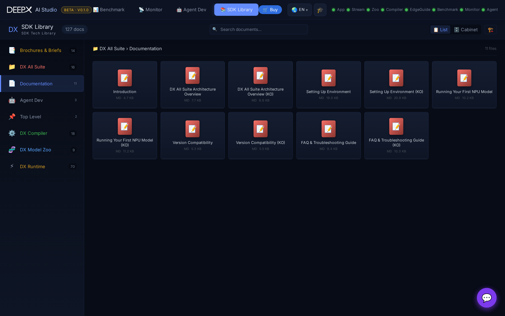

# SDK Library & About

Besides the eight tools, the hub hosts two reference views.

## SDK Library

An in-app library of DEEPX documentation and marketing material, reachable from the hub.

- **Documentation** — renders the DEEPX SDK markdown docs (architecture overview,
  environment setup, first-model walkthrough, version compatibility, FAQ, and each
  sub-project's guides) directly in the browser, with images and tables.
- **Brochures & Briefs** — product brochures and chip / module briefs as in-app PDFs.
- **Search & deep links** — filter the library and open a specific document; the current
  document is captured in the URL, so a link reopens it (for example, links arriving from
  the About page or another tool).

!!! note
    The library renders the same markdown that ships with the SDK; the document set is
    defined by the studio's SDK-library catalog and served read-only.

## About DEEPX

The **About DEEPX** page presents company and product information — the DXNN SDK
full-stack architecture, products, solutions and use cases, partners, news, and awards —
plus a shortcut to the DEEPX store. It is available in all six UI languages.
