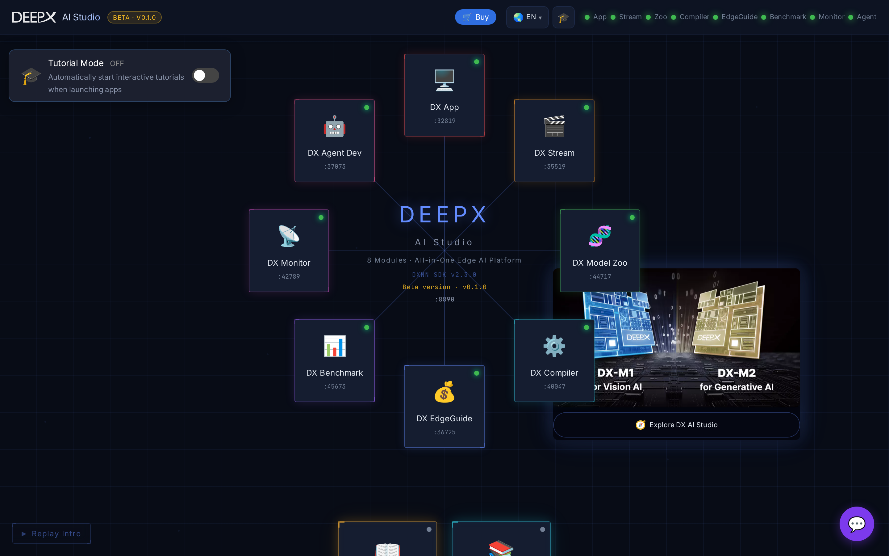

# DX-AI-Studio User Manual

**DX-AI-Studio** brings the whole DEEPX NPU SDK into one browser hub — model catalog,
compiler, inference, streaming, benchmarking, hardware monitor, deployment planner, and
an agent-driven app builder — so you can go from a trained model to a running NPU
application without leaving the page.

This manual covers how to **install and launch** the studio, use the **hub**, and work
with **every tool**.

## What's inside

| Tool | What it does |
|------|--------------|
| **DX Compiler** | Compile ONNX → `.dxnn`: config wizard, quantization tuning + diagnosis, re-quantization. |
| **DX App** | Run NPU inference on images, video, camera or RTSP; live multi-stream, benchmark & compare. |
| **DX Stream** | Real-time GStreamer vision-AI pipelines with live WebRTC playback. |
| **DX Model Zoo** | Browse 270+ DEEPX models by task; open details and use them. |
| **DX Benchmark** | Browse and compare NPU throughput / latency / multi-stream results. |
| **DX Monitor** | Live NPU + system telemetry (temperature, clock, utilization, versions). |
| **DX EdgeGuide** | Recommend the best NPU board + host for your workload from real benchmarks. |
| **DX Agent Dev** | Describe an NPU app in natural language and have a coding agent build it. |

From the hub you can also open the **SDK Library** (DEEPX docs & brochures, in-app),
**About DEEPX**, switch **language** (6 locales), and jump to the DEEPX store.

## Requirements at a glance

- The full studio runs on top of the **DEEPX SDK** (installed from `dx-runtime` /
  `dx-compiler`) with an **NPU + driver** for real inference and compilation.
- Every tool **degrades gracefully to sample / mock data** when no NPU or SDK is
  present, so the entire UI is browsable for evaluation without hardware.

See **[Installation & Launch](docs/01_Installation_and_Launch.md)** to get started, then
**[The Hub](docs/02_The_Hub.md)** for navigating the studio.

!!! note "Demo / mock mode"
    If you just want to explore the interface, you can launch the studio without an NPU
    or SDK — each tool falls back to representative sample data and clearly indicates
    when it is showing mock results.
